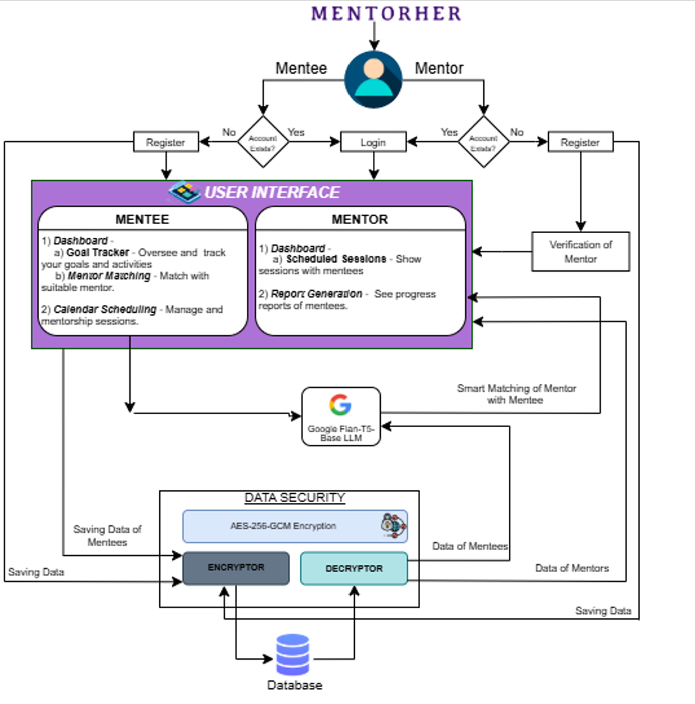

# MentorHer: Empowering Women in Tech


MentorHer is a scalable mentorship platform designed to empower women in technology through personalized career guidance, dynamic mentor-mentee matching, and AI-driven development tools. Built using a full-stack DXP (Digital Experience Platform) approach, MentorHer integrates modern technologies and AI models to offer a secure, inclusive, and interactive space for career growth.

---

## 🚀 Table of Contents
- [Problem Statement](#problem-statement)
- [Proposed Solution](#proposed-solution)
- [Key Features](#key-features)
- [Work Flow](#work-flow)
- [Technology Stack](#technology-stack)
- [Installation](#installation)
- [Usage](#usage)
- [Impact](#impact)
- [Future Vision](#future-vision)
- [Contributing](#contributing)
- [License](#license)
- [Demo](#demo)

---

## 📌 Problem Statement
Women working in technology face diverse challenges that constrain their professional growth, primarily due to the lack of proper mentorship, counseling, and networking. Large numbers of prospective women technology professionals have no proper mentors who can provide personalized advice, career growth strategies, and information on trends within the industry. 

The lack of mentorship contributes significantly to the gender gap in leadership roles and technical confidence. MentorHer bridges this gap by offering a platform that facilitates meaningful connections between mentors and mentees in tech.

---

## 💡 Proposed Solution
MentorHer uses a DXP-based architecture that enables:
- Secure registration and profile management
- Smart AI-based mentor-mentee matching
- Automated scheduling and reminders
- Real-time communication with in-app chat and video
- Career path guidance powered by AI
- Scalable infrastructure for growth and enterprise integration

---

## ✨ Key Features
- **User Registration & Profile Management**
- **AI-Driven Mentor/Mentee Matching**
- **Scheduling & Calendar Integration**
- **In-app Chat & Video Conferencing**
- **Discussion Forum & Q&A Boards**
- **Mentorship Journal & Goal Tracker**
- **Content Library (Webinars, Articles, etc.)**
- **Gamification & Reward System**
- **AI-Based Recommendations for Content & Mentors**
- **Career Pathway Generator**
- **Security & Admin Tools**
- **Multi-language Support**
- **Scalable & Modular Architecture**

---
## 🧭 Work Flow

Below is the system workflow diagram for MentorHer, highlighting user flow, AI/ML integration, data encryption, and matching logic:



------


## 🧱 Tech Stack Diagram

Below are the different tech stacks used for MentorHer:


---

## ⚙️ Installation

### Clone the Repository
```bash
git clone https://github.com/VintiB123/WomenWhoCode_InnovateHer
```

### Client-Side (Frontend)
```bash
cd WomenWhoCode_InnovateHer
cd client
npm install
npm run dev
```
Open [https://mentor-her.vercel.app/en/sign-in](https://mentor-her.vercel.app/en/sign-in) to view in your browser.

### Server-Side (Backend + AI Model)
```bash
cd server
python -m venv venv
source venv/bin/activate  # or venv\Scripts\activate on Windows
pip install -r requirements.txt
python app.py  # or main FastAPI script
```


---

## 📈 Usage
1. **Register/Login** as mentor or mentee
2. **Create Your Profile** with skills, goals, and preferences
3. **Get Matched** with mentors/mentees via AI engine
4. **Schedule Sessions** with integrated calendar and notifications
5. **Communicate** via real-time chat and video calls
6. **Track Goals**, progress, and achievements in your dashboard
7. **Engage** in the community through discussions, Q&A, and events

---

## 🌍 Impact
- Bridges the gender gap in tech mentorship
- Provides personalized guidance for career growth
- Empowers women to take charge of their learning journey
- Fosters an inclusive, global support network

---

## 🔮 Future Vision
- AI-based interview preparation
- Integration with corporate mentorship programs
- Mobile app for on-the-go mentoring
- Voice/video diary for goal tracking
- Internationalization & regional mentors
- Partnering with universities and companies

---

## 🤝 Contributing
We welcome your contributions! 🚀

1. Fork this repo
2. Create a new branch: `git checkout -b feature/your-feature`
3. Make your changes and commit: `git commit -m 'Add new feature'`
4. Push to the branch: `git push origin feature/your-feature`
5. Submit a pull request 💡

---

## 📜 License
MIT License. See [LICENSE](LICENSE) for details.

---

## 🙌 Acknowledgments
- Gemini LLMs by Google
- Vercel for seamless deployment
- Tailwind CSS for UI

> "Mentorship is the bridge that helps women cross the chasm of challenges in tech. Let's build it strong."

---

## 🎥 Demo
[Watch the demo on YouTube](https://www.youtube.com/watch?v=G1qkSbkQUiM)
